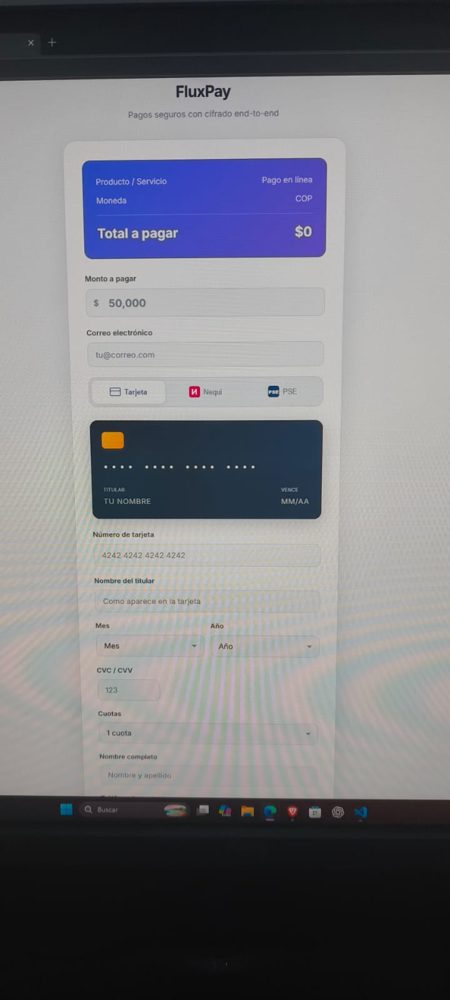
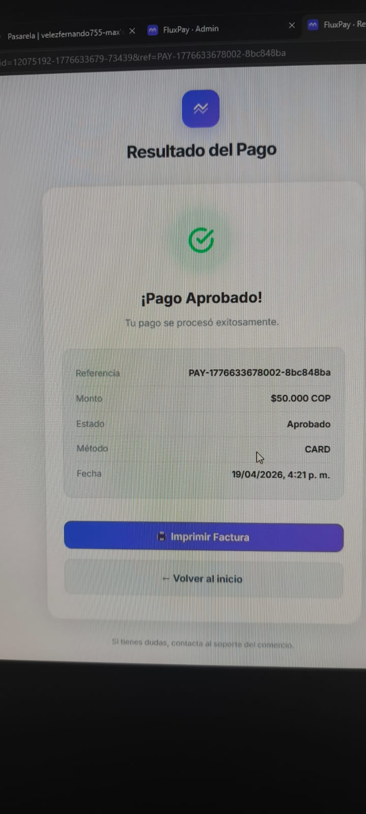
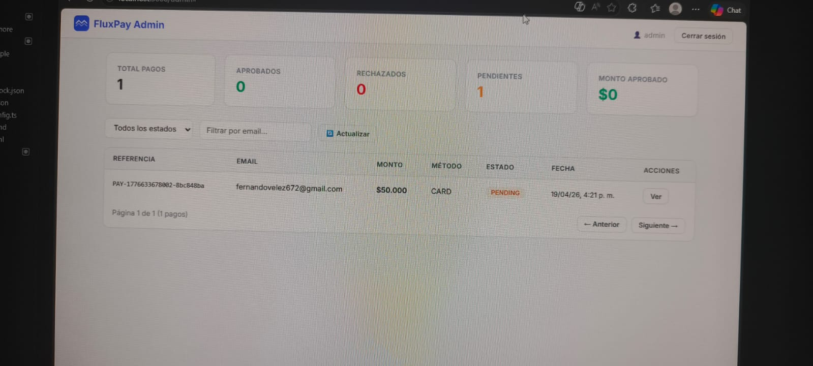

# 🏦 Pasarela de Pagos - Wompi Integration

Una pasarela de pagos moderna y segura integrada con **Wompi**, que permite procesar pagos en línea de forma segura con cifrado end-to-end. Soporta múltiples métodos de pago: tarjetas de crédito/débito, PSE y Nequi.

## ✨ Características

- ✅ Integración completa con Wompi API
- ✅ Soporte para múltiples métodos de pago (Tarjeta, PSE, Nequi)
- ✅ Tokenización segura de tarjetas
- ✅ Firmas de integridad para transacciones
- ✅ Interfaz moderna y responsiva
- ✅ Validaciones en cliente y servidor
- ✅ Rate limiting para proteger endpoints
- ✅ Seguridad con Helmet.js
- ✅ CORS configurado

## 🛠️ Tecnologías

**Backend:**
- Node.js + Express.js
- Axios para llamadas HTTP
- Crypto-js para encriptación
- Helmet.js para seguridad HTTP
- Express Rate Limit para control de tráfico
- Dotenv para variables de entorno

**Frontend:**
- HTML5
- CSS3
- JavaScript Vanilla
- Integración con Wompi Checkout

## 📋 Requisitos

- Node.js v16 o superior
- npm o yarn
- Cuenta en Wompi (https://wompi.co)

## 🚀 Instalación

1. **Clonar el repositorio:**
   ```bash
   git clone https://github.com/fernandovelezc1-cmd/Pasarela-FluxPay.git
   cd Pasarela-FluxPay
   ```

2. **Instalar dependencias:**
   ```bash
   npm install
   ```

3. **Configurar variables de entorno:**
   ```bash
   cp .env.example .env
   ```
   Editar `.env` e ingresar tus claves de Wompi

4. **Iniciar el servidor:**
   ```bash
   npm start
   ```
   Para desarrollo con auto-reload:
   ```bash
   npm run dev
   ```

5. **Acceder a la aplicación:**
   ```
   http://localhost:3000
   ```

## 📸 Demostración

### Interfaz de Pago


### Resultado Pago Aprobado


### Panel Administrativo


## 🔑 Obtener Claves de Wompi

1. Registrarse en [Wompi Dashboard](https://dashboard.wompi.co)
2. Ir a Settings → API Keys
3. Copiar las claves de **Sandbox** para testing
4. Copiar las claves de **Producción** cuando esté listo para producción
5. Guardar en el archivo `.env`

## 📡 Endpoints API

### Merchant Info
```
GET /api/merchant
```
Obtiene información del comercio y token de aceptación.

### Tokenizar Tarjeta
```
POST /api/tokenize
Content-Type: application/json

{
  "number": "4242424242424242",
  "cvc": "123",
  "exp_month": "12",
  "exp_year": "25",
  "card_holder": "John Doe"
}
```

### Crear Transacción
```
POST /api/transactions
Content-Type: application/json

{
  "amount": 50000,
  "currency": "COP",
  "customer_email": "user@example.com",
  "payment_method": { "token": "..." },
  "customer_data": { "phone_number": "+573001234567" },
  "acceptance_token": "...",
  "description": "Descripción del pago"
}
```

### Bancos PSE
```
GET /api/pse/banks
```
Obtiene lista de instituciones financieras para PSE.

## 🔒 Seguridad

- Las claves privadas **NUNCA** se envían al cliente
- `.env` está en `.gitignore` (no se versiona)
- Firma de integridad en cada transacción
- Rate limiting en endpoints API
- Validación CSRF mediante firma de transacción
- Headers de seguridad con Helmet.js
- Validaciones de entrada en servidor y cliente

## 📝 Variables de Entorno

```env
PORT=3000                              # Puerto de la aplicación
WOMPI_ENV=sandbox                      # Ambiente (sandbox o production)
WOMPI_PUBLIC_KEY_SANDBOX=...          # Clave pública para Sandbox
WOMPI_PRIVATE_KEY_SANDBOX=...         # Clave privada para Sandbox
WOMPI_EVENTS_SECRET_SANDBOX=...       # Secret para webhooks Sandbox
WOMPI_INTEGRITY_SECRET_SANDBOX=...    # Secret para integridad Sandbox
APP_URL=http://localhost:3000         # URL base de la aplicación
```

## 🧪 Testing

Para probar en Sandbox, usa las siguientes tarjetas de prueba:

**Tarjeta Aprobada:**
- Número: `4242 4242 4242 4242`
- CVC: Cualquier número de 3 dígitos
- Fecha: Cualquier fecha futura

## ⚠️ Notas Importantes

1. **No incluyas `.env` en control de versiones** - El archivo `.gitignore` ya está configurado
2. **Usa claves de Sandbox para desarrollo** - Cambia a Producción cuando esté listo
3. **Mantén tus claves privadas seguras** - Nunca las compartas
4. **Implementa validación en servidor** - No confíes solo en validación cliente

## 🤝 Contribuir

Las contribuciones son bienvenidas. Por favor:
1. Fork el proyecto
2. Crea una rama para tu feature
3. Commit tus cambios
4. Push a la rama
5. Abre un Pull Request

## 📄 Licencia

ISC

## 📧 Contacto

Fernando Vélez - [@fernandovelezc1-cmd](https://github.com/fernandovelezc1-cmd)

---

**Nota:** Esta es una integración de prueba con Wompi. Para producción, asegúrate de revisar todos los términos de seguridad y cumplimiento normativo de Wompi.
